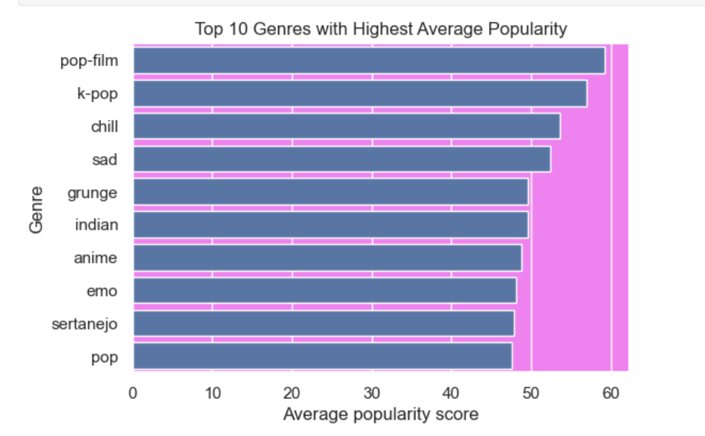
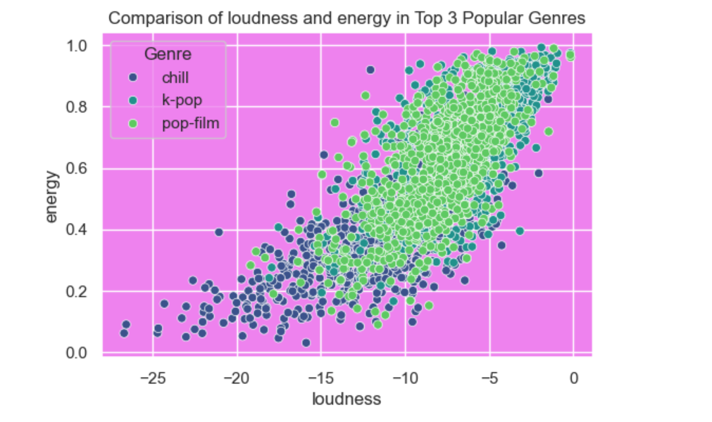

# Problem Statement

1. The goal of this project is to develop a machine learning model capable of automatically classifying audio tracks into predefined genres based on audio features extracted from the music.

2. Given a dataset containing audio samples labeled with genres, the task is to analyze patterns and distinctions in the audio features that correlate with each genre to build a reliable genre classification model.

## Business Use Case
1. Accurate genre classification enhances user experience by enabling better music recommendations, search functionality, and playlist creation. It also has potential applications in media production, content curation, and musicology research.

2. To contribute to automated music classification systems, enhancing user experience in music recommendation systems and simplifying the organization of large music libraries for both commercial and research purposes.

## Business Insights



1. Pop-Film and K-Pop Are the Most Popular Genres: The genres "pop-film" and "k-pop" have the highest average popularity scores, both close to or slightly above 55.

2. Popularity Decreases Gradually: Other genres like "chill," "sad," and "grunge" follow, with average popularity scores just below 50, while genres such as "sertanejo" and "pop" are at the lower end among the top 10. This suggests a gradual decline in popularity scores across the listed genres.



1. Positive Correlation Between Loudness and Energy: There is a clear positive correlation between loudness and energy across all genres. As the loudness increases (moving towards 0 on the x-axis), the energy level also tends to increase.

2. Genre Differences in Loudness and Energy Distribution: "Pop-film" (green dots) has higher average loudness and energy levels, clustering more toward the upper right. "K-pop" (blue dots) and "chill" (purple dots) have more spread-out distributions, with "chill" generally showing lower loudness and energy values compared to the other two genres.


## Technology Used

1. Programming: Python
2. Data Manipulation: NumPy, pandas
3. Visualization: Matplotlib, Seaborn
4. Machine Learning: XGBoost
5. Deployment: Streamlit


## Requirements

Make sure you have the following files:
- model.joblib: The trained classification model.
- encoder.joblib: The encoder for categorical features.

## Dependencies 
To install the required dependencies, run:

```bash
pip install -r requirements.txt
```

## Runnig the application
To run the Streamlit app, execute the following command:

```bash
streamlit run app.py
```